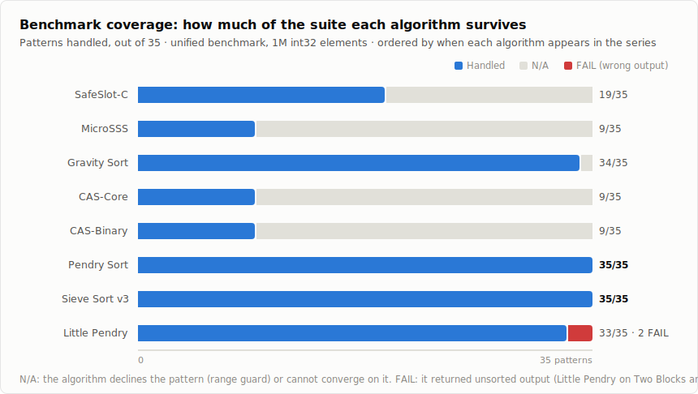
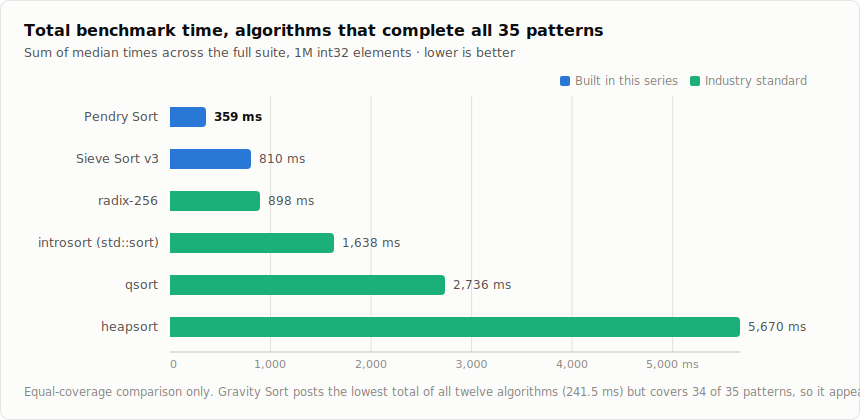

# Pendry Sort: Twelve Algorithms from First Principles

**Sammuel Pendry** · implementation written in collaboration with Claude (Anthropic) · 2026

*One observation about disorder, followed to its end: five axioms, three algorithm lineages, twelve algorithms on one benchmark, three rediscoveries named honestly, and a sorting family that finishes the full suite.*

Text CC BY 4.0 · Code Apache 2.0 · Benchmarks reproducible from [benchmarks/](benchmarks/)

---

## How this was built

I cannot read C.

The algorithms were written through a collaboration with Claude, an AI by Anthropic. I described what I wanted in plain English. Claude wrote the code. I ran the tests and reported what to fix. Every architectural decision came from me. Every performance regression was diagnosed from benchmark output, not from reading source code. Every claim in this paper is backed by running the algorithm on data and measuring what happened.

This turned out to be a good thing. Because I could not read the code and assume it was right, I tested everything.

This paper consolidates a seven-post series written during development. The posts remain the serialized edition; this is the single-document one. Nothing here claims more than the series measured, and the places where I rediscovered known algorithms are named as rediscoveries, by me, in the sections where they happened.

## Methodology, stated once

All headline results come from one unified benchmark:

- **35 input patterns** at **1 million int32 elements**: sorted, reverse, random, plateau, pipe organ, sawtooth, two blocks, outlier displacement, organ+noise, local swaps and scatter at several corruption percentages, localized corruption, heavy duplicates, narrow range, binary, ternary, Gaussian, Zipf-like, wide and huge ranges, clustered values, and uniform over [-1B, 1B].
- **12 algorithms**: eight from this series, plus radix-256, GCC's introsort (the algorithm under `std::sort` in libstdc++), C stdlib `qsort`, and heapsort.
- **Median of repeated trials** (5 in the Python suite, 7 in the C suite), fixed seed, output verified sorted on every run.
- Compiled `gcc -O2`, single machine. Absolute times are machine-specific; the ratios are the claims. The full harness for both languages is in [benchmarks/](benchmarks/), so the numbers can be reproduced or refuted on your hardware.

Two scoring notes that keep the tables honest. **N/A** means an algorithm declines a pattern (a built-in range guard) or cannot converge on it; **FAIL** means it returned unsorted output. And **totals are only comparable between algorithms tested on the same patterns**. That caveat matters and gets repeated where it applies.

A fairness note on baselines: `qsort` pays function-pointer overhead on every comparison, which makes it a soft target. The introsort comparison is the fairer one. Both are reported.

---

## Part 1 · Disorder Clusters

I was procrastinating on SQL homework when I noticed something about sorted data that I couldn't stop thinking about.

If you take a sorted array and mess up a small piece of it, a batch write failure, a sensor glitch, a handful of records arriving out of order, the disorder isn't spread evenly. It clusters. There are pockets of chaos in a sea of order. And every sorting algorithm I could find ignores that. They treat the whole array as a uniform problem: scan everything, compare everything, sort everything.

What if you found the pockets and fixed just those?

### Safe-Slot Sort

An *inversion* is a position where `array[i] > array[i+1]`, a pair that's locally out of order. When you find one, the elements nearby are usually also displaced. Capture a window around each inversion (±8 elements) and you grab the whole problem region. If two inversions are far apart, their windows don't overlap and the problem decomposes into small, independent subproblems.

```
1. Scan array for inversions (a[i] > a[i+1])
2. If no inversions: done, array is sorted
3. For each inversion, mark indices within ±window
4. Collect all marked indices (overlapping windows merge)
5. Sort the values at those indices
6. Place sorted values back
7. Repeat until no inversions remain
```

On nearly-sorted data, inversions are sparse: O(n) to find them, then O(k log k) to fix k displaced elements. When k is much smaller than n, that approaches linear time. A presort check (150 samples) detects reverse-sorted input and flips it first; without that check, reversed input ran 97x slower than Python's `sorted()`, and with it, faster.

The window size of 8 was found experimentally and never optimized. Every benchmark in the series uses it. That remains an unexplored dimension.

### What the Python version measured

At 1M elements against `numpy.sort()`: 4.6x faster on sorted data, 4.0x on reversed, 3.7x on plateau, 4.6x on 0.1% localized corruption. And then the other side of the ledger: 3.5x *slower* at 5% local swaps, 5.7x slower at 5% scatter, 88x slower on heavy duplicates, and **no result at all** on random, pipe organ, sawtooth, and nine other patterns. Marked N/A on 12 of 35, FAIL on one, #6 of 8 Python algorithms by total time.

The killer is what I came to call the **diffusion problem**. Move one element from position 0 to position 10,000,000. The algorithm sees one inversion, fixes a window of 8, and the displaced element moves about 8 positions per iteration. With a 100-iteration cap, an element that needs to travel millions of positions never gets home, and the output is unsorted. Producing unsorted output isn't slow. It's broken.

An adaptive Python wrapper (estimate disorder, route to Safe-Slot or `numpy.sort()`) fixed most of it on the first try, no tuning: 1.42x faster than `numpy.sort()` in aggregate across the 30 patterns it ran, the best aggregate of any Python algorithm in the suite. But five periodic patterns still fooled its evenly-spaced disorder probes.

### The three tenets

Three principles crystallized here and drove everything after:

> **1. Structure exists; exploit it.** Don't assume your data is random. Most data in real systems isn't.

> **2. Find inversions; fix locally.** When something is broken, fix that thing. Don't tear the whole structure down and rebuild it.

> **3. Work scales with disorder.** A nearly-sorted array should take nearly no work. Effort should match how much is wrong, not how much data exists.

They read as obvious. In retrospect, they are. But quicksort violates the first (it partitions everything, even the parts already partitioned), merge sort violates the second (it tears the array apart and rebuilds from scratch), and heapsort violates the third (O(n log n) regardless of input order). Safe-Slot obeys all three, which is why it flies on structured data, and why it dies without a fallback when disorder doesn't cluster.

---

## Part 2 · The C Port

In Python, Safe-Slot beat `sorted()` by 2–3x on nearly-sorted data. Useful, but modest. I wondered whether interpreter overhead was masking what the algorithm could do. So it went to C.

**18x faster than qsort. Wins up to 70% corruption. 50 lines.** The original benchmark showed 18.7x on 0.01% localized corruption at 10M elements. In the unified benchmark at 1M, sorted data runs 1.5ms against qsort's 53.2ms, a 35x gap (against introsort, 16.2ms, the gap narrows but persists). Local swaps at any tested percentage: 5.4–7.5ms against qsort's 52–53ms. Scatter stays winning through 100% corruption at roughly 5.4x.

And the failures ported too. Faster failure is still failure: single-element displacement across the array, circular shifts, sawtooth, and reversed chunks all produced NOT SORTED after 100 iterations, in C exactly as in Python. The diffusion problem is language-independent. SafeSlot-C is tested on only 19 of 35 patterns; the other 16 are N/A. Its total across those 19, 194,628 µs, ranks #4 of 12, with the caveat that a 19-pattern total and a 35-pattern total are different races.

The algorithm evolved through four versions: **bailout** (detect stalling, grinding, or excessive coverage; fall back to qsort; every adversarial pattern passes, worst case 1.74x over qsort), **adaptive** (gap-sized windows for far displacement, spacing-matched windows for periodic patterns, dirty-section rescanning), and **lean** (lazy allocation, range-tracked mask clearing; ~25 MB down to ~17 MB at 1M elements).

### The minimal core

Following the tenets to their logical conclusion produces something that already exists.

```c
// 7 lines. The tenets, implemented.
void sort(int* a, int n) {
    for (int i = 0; i < n - 1; i++)
        if (a[i] > a[i+1]) {
            int v = a[i+1], j = i;
            while (j >= 0 && a[j] > v) { a[j+1] = a[j]; j--; }
            a[j+1] = v;
        }
}
```

It's insertion sort. Walk left to right. In-order elements cost one comparison: structure exists, exploit it by doing nothing. Out-of-order elements slide backward to their place: fix locally. Nearly-sorted input runs O(n), random runs O(n²): work scales with disorder. The practical version, Micro SSS, adds a 50-sample reverse detector. Twenty lines, no malloc, never loses to qsort on local adjacent swaps at any size, and goes from 15ms to catastrophe at just 1% scattered corruption.

---

## Part 3 · Who Decided What Sorted Is?

Imagine you're walking on a beach. You stumble on a line of sand grains arranged perfectly by size. You marvel at how sorted that line is. Meanwhile the entire beach sits there, billions of grains, each one exactly where physics put it. Nobody sorted the beach. The beach sorted itself.

But you're staring at the one line, asking: is grain A smaller than grain B?

You're asking the wrong question. The O(n log n) floor is proven for comparison sorts, and it only binds you if you compare.

### Gravity Sort

Heavy things sink. Count what's there and let gravity stack it.

```c
void gravity_sort(int* a, int n) {
    if (n <= 1) return;
    int lo = a[0], hi = a[0];
    for (int i = 1; i < n; i++) {
        if (a[i] < lo) lo = a[i];
        if (a[i] > hi) hi = a[i];
    }
    if (lo == hi) return;
    int range = hi - lo + 1;
    int* weight = calloc(range, sizeof(int));
    for (int i = 0; i < n; i++) weight[a[i] - lo]++;
    int pos = 0;
    for (int w = 0; w < range; w++)
        for (int c = 0; c < weight[w]; c++)
            a[pos++] = w + lo;
    free(weight);
}
```

**The admission, first of three:** Gravity Sort is counting sort. So is Echo Sort, the same math under a different metaphor I wrote pages about before recognizing it. This was the first time I rediscovered something by giving it a new name, and it would not be the last. Metaphors can fool you.

Rediscovered or not, it wins. **#1 of 12 by total time**: 241,526 µs across the 34 patterns it runs (Pendry Sort is second at 359,174, radix-256 third at 897,877, everything else above a million). Ten pattern wins, zero failures. It cannot tell 0% corruption from 100% because it never asks about shape: 7.2ms either way. On pipe organ, near-worst-case for quicksort pivots, qsort takes 241.9ms and Gravity takes 6.2ms, a 39x gap it achieves without noticing the pattern exists.

The honest limits: it needs the value range to fit in memory (its one N/A is Uniform [-1B, 1B], where the frequency array would be 8 GB), integers only, and it is not the fastest on any single pattern where Pendry Sort also runs. It wins on aggregate by being consistently good at almost everything. The tortoise, not the hare.

### Three philosophies

By this point three answers to "what is sorting?" were on the table. **Counting:** sorting is observation; the data already knows where it belongs. **Inversion repair:** sorting is repair; most of the structure is fine, fix what's broken. **Traditional comparison:** sorting is judgment; assume nothing, compare everything, rebuild from scratch. Each has a domain where it's unbeatable, and the benchmark quantifies all three.

---

## Part 4 · Why Look When You Can Just Do?

Inside a coworker's code I found this:

```
new FileStream(path, FileMode.Create, FileAccess.Write);
```

No check whether the file existed. The standard pattern is check, look, delete, create: four operations. His reasoning, I figured: we don't have many files, we'll replace this one soon anyway. So why look? Just create. `FileMode.Create` doesn't ask. If something was there, it's gone. If nothing was there, now something is. One action, and the state afterward IS the goal.

I stared at that line for a while. Then I went home and rewrote everything I'd been doing with sorting.

The result was Consequence-as-Action Sort, CAS: walk the array, and when something is broken, cascade it backward until it settles. Where it stops IS where it belongs. The shifted elements ARE the sub-fixes. Reaching the end without triggering IS the proof of sorted. No separate observe, plan, execute, verify.

**The admission, second of three:** this is insertion sort. Not inspired by. Not related to. It *is* textbook insertion sort with a skip check. And the "gravity" and "echo" comparison variants and Micro SSS were all the same algorithm too, three metaphors for one motion. Part 3 asked "who decided what sorted is" and spent pages on three sorts that turned out to be one sort wearing different clothes. That's embarrassing. It's also honest. And a new way of seeing something old is sometimes the contribution: the CAS framing asks *what information does the fix itself produce?* Distance traveled = displacement, never calculated. Settling point = correct position, never searched for. No more triggers = sorted, never verified. That question became the design driver for everything after.

**CAS-Binary**, the production variant, swaps the linear cascade for binary search plus one `memmove` per displaced element: 18,205 µs total across its 9 tested patterns, the lowest per-pattern cost of anything in the suite, and 26 N/A columns that keep it out of the open division.

Three optimizations failed, and each failure taught something. **SIMD scanning** (AVX-512, 16 elements at once) made everything worse, up to 2x on adversarial data: finding inversions was never the bottleneck; fixing them is. Profile before you optimize. **Repair blocks** (fix a contiguous dirty block at once) matched CAS-Core exactly: extra steps around the same motion are waste. **4-way parallelism** cut adversarial times ~60% at the cost of O(n) merge memory: parallelism helps when the problem decomposes cleanly, and only then.

Out of CAS came the fourth axiom:

> **4. The consequence of the action contains the information.** Collapse observe-plan-execute-verify into one motion. The fix IS the observation IS the proof.

---

## Part 5 · Where the Thread Ends

Counting sort is nearly unbeatable inside its range constraint. I tried to beat it anyway.

The idea: in a uniformly distributed array, value `v` belongs approximately at position `(v - lo) * n / range`. Each element carries its own destination. So scatter everything to its approximate position, then repair the small errors locally.

**Attempt 1, direct scatter with linear probing: failed badly.** The disorder left after scattering isn't localized, it's scattered, exactly the input class that broke Safe-Slot in Part 1. Same structural failure, different algorithm.

**Attempt 2, bucket scatter: worked.** Drop each element into one of n/8 buckets, sort each ~8-element bucket, done. Faster than counting sort on wide ranges, slower inside counting sort's home range. So: **one `if`.** Range ≤ 4n routes to counting sort with direct sequential fill (no prefix sums, no backwards pass, stability traded for cache behavior). Range > 4n routes to bucket scatter.

**The admission, third of three:** the bucket path is Flash Sort (Neubert, 1998), and adaptive switching of this kind exists in Spreadsort (Ross, Boost C++). Three people arriving at the same place from different directions. Convergent discovery, confirmed and named.

Then the last experiment, and the one I care most about. Every bucket was being insertion-sorted blind, even buckets that arrived already ordered. Part 1 had the answer sitting on the shelf: scan for inversions first; if none, skip the bucket entirely; if some, window-repair just the dirty span.

```c
static inline void disorder_repair(int32_t *a, int n) {
    if (n <= 1) return;
    int first_inv = -1;
    for (int i = 0; i < n-1; i++)
        if (a[i] > a[i+1]) { first_inv = i; break; }
    if (first_inv < 0) return;  // Already sorted
    if (n <= 24) { isort(a, n); return; }
    // Find dirty window, sort only that, verify
    // Safety fallback to full isort if window missed something
}
```

The insight that failed as a standalone sort works inside a bucket, because a bucket bounds displacement to the exact scale where windowed repair is valid. Flash Sort finishes buckets with insertion sort; Spreadsort with pdqsort. I have not found prior use of an inversion scan that skips ordered buckets and window-repairs the rest. I claim it as one of the two candidate contributions of this series, alongside the direct-fill counting path, with the honest caveat that "I have not found it" is a search claim, not a proof of novelty.

The full circle: the counting path came from Part 3. The scatter came from asking what values already know. The repair came from Part 1, the idea that started everything, home at last in a container sized to its actual domain. Nothing was wasted.

---

## Part 6 · Sieve Sort

Pendry Sort's speed depends on integer arithmetic: counting and scattering don't compare, and don't generalize. The philosophy should. Sieve Sort is the test of that claim on any comparable type.

**The window detector.** Before sorting anything, find what needs sorting. Forward pass tracking the running max: every element below it is out of place; the last such position is the window's right edge (min and max fall out of the same walk). Backward pass with the running min finds the left edge. Two passes, O(n) time, O(1) space, and everything outside the window is *confirmed* correct. A sorted array costs n−1 comparisons and exits.

**Three paths from the window.** Tiny window (≤32): insertion sort. Low cardinality (integer specialization): counting sort. Everything else: natural merge sort, which finds ascending runs, reverses descending runs in place, and merges bottom-up. Earlier prototypes had inversion counting, threshold routing, and stacked fallbacks; removing them was the fix. Sieve Sort sits in the Timsort family, distinguished by running the window detector before run detection rather than starting with runs.

**Results at 1M, all 35 patterns, zero N/A, zero FAIL:** 810,240 µs total, #6 of 12, 3.4x faster than qsort and 2.0x faster than introsort in aggregate. Its wins are the patterns that punish everyone else: **Outlier, 6.1ms**, where Pendry Sort posts its worst result in the whole benchmark (127.1ms, a 20x gap) because Pendry's scan reads one far-displaced element as high disorder and scatters a million elements to fix one, while Sieve's detector finds the small dirty region and insertion-sorts it. **Two Blocks, 7.1ms** against Pendry's 19.3ms: the detector marks everything dirty, and natural merge finds two long runs and merges them once. The losses are just as real: random 102.5ms against Pendry's 10.6ms, organ+noise 172.7 against 10.0. Merge buffers cost more than integer scatter. That's the price of generality.

The original Sieve benchmarks also ran int32, int64, double, and Record{key, payload}: performance tracked the data's pattern, not its type, 36 pattern wins against qsort's 0 across the four types. The philosophy is separable from integer arithmetic.

---

## Part 7 · Pendry Sort

### The five axioms

Five principles, each traceable to a specific failure or insight:

> **1. Structure exists; exploit it.** (Part 1)

> **2. Find inversions; fix locally.** (Part 1)

> **3. Work scales with disorder.** (Part 2)

> **4. The consequence of the action contains the information.** (Part 4, the FileMode.Create moment)

> **5. One touch, maximum extraction.** Every time you load a value, get everything you can from it. (Part 5, crystallized when one 16-point sample started producing inversions AND range AND routing hints from the same 32 loaded values)

The specific algorithms will be superseded. The five questions are about design, not about sorting.

### The architecture

Pendry Sort takes a source array of int32 and writes sorted output to a destination array. Not in-place, not stable. Three phases:

- **Phase 0, merged scan-route-repair.** A 16-point sample classifies the input while extracting an approximate range from the same loads. It routes to reverse handling, a full merged scan, or straight to a sorting phase. The merged scan counts inversions AND tracks the dirty window AND records bail coordinates in one walk; work done before a bail is carried, not discarded; verification after a windowed repair is two boundary comparisons, not O(n). No pass serves only one purpose. That is axiom 5 as machinery.
- **Phase 1, direct-fill counting sort** when range ≤ 4n. No prefix sums. A duplicate-heavy fast path runs 6.0x faster at 99% duplicates.
- **Phase 2, bucket scatter + disorder repair** when range > 4n. Flash Sort's structure, finished by the inversion-scanning repair instead of blind insertion sort.

**Little Pendry** asks whether the 384-line algorithm compresses: 87 lines, in-place, keeping the sample, the merged scan, and the counting path, replacing scatter and introsort with shellsort. It totals 474,821 µs, 33 of 35 tested, with 2 FAILs (Two Blocks, Outlier); the series reports it 2.7x faster than radix-256 and 4.1x faster than introsort on the patterns it completes. Three proofs, one philosophy: Little Pendry shows it compresses, Sieve Sort shows it generalizes, Pendry Sort shows it performs.

### The full family



| Algorithm | Total (µs) | Wins | Tested | N/A | Fail | Origin |
|---|---|---|---|---|---|---|
| CAS-Binary | 18,205 | 0 | 9 | 26 | 0 | Part 4 |
| CAS-Core | 55,067 | 7 | 9 | 26 | 0 | Parts 2/4 |
| MicroSSS | 56,675 | 0 | 9 | 26 | 0 | Part 2 |
| SafeSlot-C | 194,628 | 0 | 19 | 16 | 0 | Parts 1/2 |
| **Gravity Sort** | **241,526** | **10** | 34 | 1 | 0 | Part 3 |
| **Pendry Sort** | **359,174** | **11** | **35** | **0** | **0** | Part 5 |
| Little Pendry | 474,821 | 2 | 33 | 0 | 2 | Part 7 |
| Sieve Sort v3 | 810,240 | 4 | 35 | 0 | 0 | Part 6 |
| radix-256 | 897,877 | 1 | 35 | 0 | 0 | Industry |
| introsort | 1,637,971 | 0 | 35 | 0 | 0 | Industry |
| qsort | 2,736,355 | 0 | 35 | 0 | 0 | C stdlib |
| heapsort | 5,670,212 | 0 | 35 | 0 | 0 | Industry |

*Totals are only comparable at equal coverage. CAS-Core's 55K across 9 patterns is brilliant on its turf; it can't enter the other 26.*



On the equal-coverage comparison, Pendry Sort finishes the suite **4.6x faster than introsort and 7.6x faster than qsort**, with the most pattern wins (11) of any algorithm, and zero N/A or FAIL.

The N/A column is the series in one number: SafeSlot-C, 16. The CAS family, 26. Gravity, 1. Pendry and Sieve, 0. Each part filled in more of the table.

### The family tree

**Inversion-repair lineage:** Safe-Slot → MicroSSS → CAS-Core → CAS-Binary. Unmatched on nearly-sorted data, unusable elsewhere. **Distribution lineage:** Gravity → adaptive switch → Pendry Sort → Little Pendry. Handles everything, integers only. **Measurement-first lineage:** Sieve Sort. Type-agnostic, stable, slower on integers. And the crossover that makes it a family rather than a list: disorder repair, born in lineage one, finishes the buckets of lineage two; the reverse-detection sample from the CAS work became Phase 0.

---

## Honest accounting

**Integer only** (Pendry, Little Pendry, Gravity). For floats, strings, structs, or comparators, use Sieve Sort. **Not stable.** Direct fill trades stability for cache behavior. **Not in-place** (Pendry needs a destination array; Little Pendry is the in-place variant and pays 2 FAILs for its simplicity). **The wide-range regime is the weak point:** radix-256 beats Pendry on Uniform [-1B, 1B], 26.9ms to 38.0ms. **Behavior classes are measured, not proven.** No formal complexity proofs; the claims are empirical and the harness is included. **Single-machine timings.** The ratios, not the milliseconds, are the result. **Three rediscoveries, named:** Gravity/Echo is counting sort; CAS is insertion sort; the bucket path is Flash Sort, with the adaptive switch present in Spreadsort. **Two candidate contributions, hedged:** the inversion-scanning bucket finisher and the direct-fill counting path, claimed only as "I have not found prior use," which is a search statement, not a novelty proof. **Window size 8 was never tuned.** **And the whole thing was designed by someone who cannot read the code**, which is disclosed at the top because it is a fact about the method, not a footnote.

## What I learned

**Failure modes are the curriculum.** Every algorithm was born from the failure of the one before it. The idea that failed as a standalone sort became the contribution once it found a container matched to its domain.

**Honest accounting matters more than good results.** Naming the rediscoveries myself is what keeps the wins credible.

**The philosophy outlasted the code.** Five axioms survived twelve algorithms. The questions are about design, not sorting.

**You don't need credentials to contribute.** I'm a high school dropout. I can't read C. The collaboration model, human architecture and judgment, machine implementation, empirical validation of everything, worked.

Knowledge should never die on the back of a napkin in a dive bar. Even when most of it turns out to be rediscovery, the path someone takes to rediscover a thing is often more useful than the thing.

---

## Reproducing the results

```
# C suite (12 algorithms, 35 patterns)
gcc -O2 -o pendry_bench benchmarks/pendry_benchmark.c -lm
./pendry_bench                 # 1M elements, full trials
./pendry_bench 100000 quick    # smaller, faster

# Python suite (the Part 1 era algorithms)
python benchmarks/pendry_benchmark.py            # 1M elements
python benchmarks/pendry_benchmark.py --quick    # 100K, 3 trials
```

Every algorithm in this paper appears in the harness exactly as benchmarked, alongside the data generators for all 35 patterns and the correctness verification run on every trial.

---

*Text CC BY 4.0. Code Apache 2.0. Developed through guided AI project development with Claude (Anthropic): the architecture, decisions, and testing are mine; the implementation is the collaboration's.*
